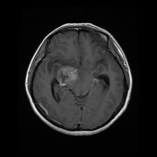
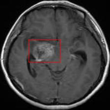

<div align="center">

# 🏥 WellScan Healthcare

### AI-Powered Brain Tumor Detection & Segmentation with Blockchain Medical Records

[](https://python.org)
[](https://tensorflow.org)
[](https://flask.palletsprojects.com)
[](https://nextjs.org)
[](https://ethereum.org)
[](https://mongodb.com)

</div>

---

## 📌 Problem Statement
 
Brain tumors are the second most frequent cause of cancer worldwide. Manual MRI analysis is time-consuming, error-prone, and specialist-dependent — any mistake in reading scans can be life-threatening. Additionally, patient medical records are siloed across hospitals, raising serious data privacy and integrity concerns.
 
WellScan addresses both problems by combining:
- **Deep learning** for fast, accurate brain tumor detection & segmentation (second opinion for doctors)
- **Blockchain** (Ethereum smart contracts) for tamper-proof, decentralized medical record storage

---

## 🧠 What It Does
 
| Feature | Description |
|---|---|
| **Tumor Classification** | Classifies MRI scans into 4 classes: Meningioma, Glioma, Pituitary Tumor, No Tumor |
| **Tumor Segmentation** | Pixel-level mask highlighting exact tumor boundaries |
| **Bounding Box Detection** | Locates and draws bounding box around detected tumor region |
| **Blockchain Records** | Patient & doctor records stored on Ethereum — tamper-proof & decentralized |
| **Doctor Portal** | Schedule appointments, view patient records (with permission), run AI diagnosis |
| **Patient Portal** | Grant/revoke doctor access to medical records, view profile & appointments |
| **Admin Panel** | KYC verification, create doctor/patient accounts, issue MetaMask credentials |
| **Dashboard** | Live stats — registered patients/doctors, appointments, monthly growth |
 
---
---

## 🏗️ System Architecture
 
```
┌─────────────────────────────────────────────────────────────────┐
│                        WellScan System                           │
├──────────────────┬───────────────────┬──────────────────────────┤
│   AI Backend     │   Node Server     │   Blockchain Frontend    │
│   (Flask/Python) │  (Express/Mongo)  │   (Next.js/Ethereum)     │
│                  │                   │                          │
│ Attention        │ Doctor/Patient    │ Smart Contract           │
│ ResU-Net         │ KYC Registration  │ (Solidity — Record.sol)  │
│                  │ Auth & Storage    │ MetaMask Integration     │
│ Classification   │ (MongoDB)         │ Sepolia Testnet          │
│ + Segmentation   │                   │ ABI ↔ Web3.js            │
└──────────────────┴───────────────────┴──────────────────────────┘
```
 
## 🤖 Deep Learning Model — Attention ResU-Net
 
A custom **AttentionResUNet with Classifier** — combines U-Net segmentation architecture with ResNet skip connections and attention gates, plus an integrated classification head.
 
**Dual output heads:**
- **Classification head** → 4-class softmax (Meningioma / Glioma / Pituitary / No Tumor)
- **Segmentation head** → pixel-wise binary mask of tumor region
**Architecture highlights:**
- Encoder: convolutional blocks with max pooling for spatial downsampling
- Decoder: upsampling layers reconstructing high-resolution segmentation maps
- Skip connections between encoder/decoder for detail preservation
- Attention gates focusing the model on tumor-relevant regions
- Batch normalization + dense layers for classification
**Preprocessing pipeline:**
1. Otsu thresholding → binary mask
2. Contour detection → crop to brain region (removes background noise)
3. Resize to 224×224
4. Z-score normalization (mean=0, std=1)
5. Data augmentation: rotation, flipping, shifting
**Training:**
- Dataset: 3,727 MRI images + masks (Kaggle — Brain Tumor.npy by AWSAF + Brain Tumor Classification dataset)
- Split: 80% train / 10% validation / 10% test
- Optimizer: Adam with ReduceLROnPlateau
- Epochs: 50 | Batch size: 32
- Hardware: Kaggle GPU P100 (15GB RAM)
---
 
## 📊 Model Performance
 
| Metric | Training | Validation |
|--------|----------|------------|
| Classification Accuracy | 98.73% | 97.18% |
| Segmentation Accuracy | 99.48% | 99.25% |
| Mean IoU | 0.7312 | 0.6397 |
| Dice Coefficient | 0.8438 | 0.7769 |
| Total Loss | 0.0523 | 0.0928 |
| Optimal Threshold | 0.38 | — |
 
---
 
## 🖼️ Sample Results
 
| Input MRI | Tumor Detection (Bbox) | Segmentation Mask |
|:---------:|:----------------------:|:-----------------:|
|  |  |  |
 
---

## 🛠️ Tech Stack
 
**AI/ML:** Python 3.11 · TensorFlow 2.15 · Keras · OpenCV · NumPy · SciPy · Matplotlib · Flask  
**Backend:** Node.js · Express.js · MongoDB · Mongoose  
**Frontend:** Next.js · HTML · CSS · JavaScript  
**Blockchain:** Ethereum (Sepolia Testnet) · Solidity · Web3.js · MetaMask
 
---

## 🚀 Running Locally (3 Services)

### Prerequisites
 
- Python 3.11
- Node.js 18+
- MongoDB (running locally)
- MetaMask browser extension (connected to Sepolia testnet)
- Model weights file: `AT_RESu_net_all_STD_0.0927_th=0.38.hdf5`
  *(Too large for GitHub — [Download from Google Drive](YOUR_DRIVE_LINK_HERE))*
---
 
### 1️⃣ AI Backend — Flask (Port 5000)
 
```bash
cd backend
python -m venv venv
 
# Windows:
venv\Scripts\activate
# Mac/Linux:
source venv/bin/activate
 
pip install -r requirements.txt
 
# Place the .hdf5 model file inside backend/ folder, then:
# Windows:
set MODEL_PATH=AT_RESu_net_all_STD_0.0927_th=0.38.hdf5 && python app.py
# Mac/Linux:
MODEL_PATH=AT_RESu_net_all_STD_0.0927_th=0.38.hdf5 python app.py
```
 
✅ Wait for: `Running on http://0.0.0.0:5000`
 
**Test the API:**
```bash
curl -X POST http://localhost:5000/predict \
  -F "file=@docs/screenshots/sample_mri_input.jpg"
```
 
Expected response:
```json
{
  "prediction": "glioma 97.43%",
  "original_img": "/static/uploads/bbox_sample_mri_input.jpg",
  "segmented_img": "/static/uploads/segmented_sample_mri_input.jpg"
}
```
 
---
 
### 2️⃣ Node Auth Server — Express (Port 8080)
 
```bash
cd server
npm install
node index.js
```
 
✅ Wait for: `server started` and `db connected`
 
> Make sure MongoDB is running before this step (`mongod` in a separate terminal if not running as a service)
 
---
 
### 3️⃣ Blockchain Frontend — Next.js (Port 3000)
 
```bash
cd blockchain
npm install --legacy-peer-deps
 
# First time only — deploy smart contract:
cd ethereum
node compile.js
node deploy.js
# Copy the deployed contract address from output → paste into your web3 config
 
cd ..
npm run dev
```
 
✅ Open browser → [http://localhost:3000](http://localhost:3000)
 
> Make sure MetaMask is installed and connected to **Sepolia Test Network**
 
---

## 📁 Project Structure

```
wellscanhealthcare/
├── backend/                    # Flask AI inference server
│   ├── app.py                  # Main Flask app (fixed, no hardcoded paths)
│   ├── requirements.txt
│   └── static/uploads/         # Runtime: stores predictions
│
├── server/                     # Express.js auth & registration server
│   ├── index.js                # REST API (doctors/patients CRUD)
│   └── package.json
│
├── blockchain/                 # Next.js frontend + Ethereum smart contracts
│   ├── pages/                  # UI pages (dashboard, registration, diagnosis)
│   ├── components/             # Shared layout & nav
│   ├── ethereum/
│   │   ├── contracts/Record.sol  # Solidity smart contract
│   │   ├── compile.js
│   │   └── deploy.js
│   └── package.json
│
├── docs/screenshots/           # Sample MRI images & outputs
└── README.md
```

---

## ⛓️ Blockchain Flow
 
1. Admin verifies KYC forms → creates doctor/patient accounts
2. Admin issues 12-word MetaMask seed phrase to verified users
3. Users connect MetaMask wallet to the website
4. Patient records stored on Ethereum via Hospital Smart Contract (`Record.sol`)
5. Patients grant/revoke doctor access to their records on-chain
6. All transactions are timestamped and tamper-proof on the Sepolia blockchain
---
 
## 📚 Dataset
 
- **Segmentation:** Brain Tumor.npy by AWSAF — [Kaggle](https://www.kaggle.com/)
- **Classification:** Brain Tumor Classification Dataset — [Kaggle](https://www.kaggle.com/datasets/masoudnickparvar/brain-tumor-mri-dataset)
- 3,727 MRI scans with corresponding tumor masks
---

## 📄 License
 
MIT License — free to use for academic and personal projects.


## 📄 License

MIT License — free to use for academic and personal projects.
